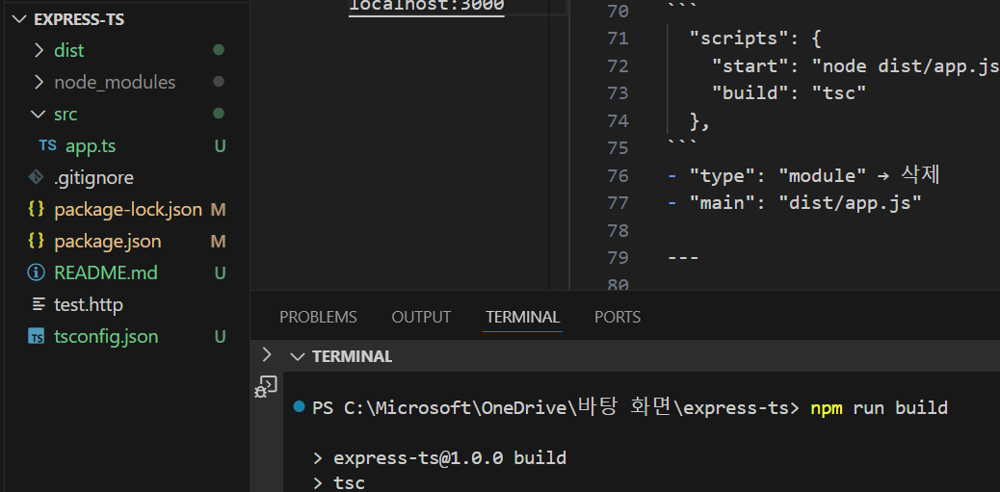

## 바로가기

#### 1. [타입스크립트 설치](https://github.com/devellybutton/Codeit_Express_TypeScript?tab=readme-ov-file#1-타입스크립트-설치-1)
#### 2. [개발환경 편하게 쓰기](https://github.com/devellybutton/Codeit_Express_TypeScript?tab=readme-ov-file#2-개발환경-편하게-쓰기-1)
#### 3. [타입 패키지 설치하기](https://github.com/devellybutton/Codeit_Express_TypeScript?tab=readme-ov-file#3-타입-패키지-설치하기-1)
#### 4. [Express 핸들러 타입 사용하기](https://github.com/devellybutton/Codeit_Express_TypeScript?tab=readme-ov-file#4-Express-핸들러-타입-사용하기-1)
#### 5. [패키지의 타입 커스텀하기](https://github.com/devellybutton/Codeit_Express_TypeScript?tab=readme-ov-file#5-패키지의-타입-커스텀하기-1)

---

# 1. 타입스크립트 설치

### 1) 프로젝트 세팅

#### 프로젝트 시작
```
npm init
```

#### Express설치
```
npm i express
```

#### package.json 파일에 추가
```
  "type": "module" // ES6을 사용 목적
  "main": "app.js", // 실행 파일 설정
  "scripts": { // 명령어 변경
    "start": "node app.js",
  }  
```

#### 서버 실행
```
npm start
```

#### Request 보내서 테스트하는 방법
1. REST Client Extension 설치
2. test.http 파일 만들기
3. 서버를 실행
4. GET http://localhost:3000 입력하면 위에 'Send Request' 버튼 클릭
5. 응답 결과가 우측에 뜸.

### 2) 타입스크립트 설치

#### 타입스크립트 설치
```
npm i --save-dev typescript
```
- 타입스크립트는 개발환경에서만 필요하니까 --save-dev 옵션 꼭 쓰기

#### tsconfig.json 파일을 생성
```
npx tsc --init
```

- TypeScript 컴파일러에 대한 설정을 정의

#### 프로젝트 폴더 분리
```
 "rootDir": "src",    
  "outDir": "dist",   
 ```
- "rootDir": "src" : TypeScript 소스 파일(.ts 파일)이 위치하는 기본 디렉토리를 지정
- "outDir": "dist" : 컴파일된 JavaScript 파일이 저장될 위치를 지정

#### package.json 설정 변경
- 스크립트 명령어 변경
```
  "scripts": {
    "start": "node dist/app.js",
    "build": "tsc"
  },
```
- "type": "module" → 삭제
- "main": "dist/app.js"

#### 빌드
```
npm run build
```


---

# 2. 개발환경 편하게 쓰기

- 타입스크립트는 소스코드를 수정하면 빌드를 해서 JS로 만든 다음 실행을 해야됨. <br>
→ ts-node 와 nodemon으로 개발환경 편하게 세팅할 수 있음.

#### ts-node 설치
```
npm i --save-dev ts-node
```
- https://www.npmjs.com/package/ts-node

#### 스크립트 명령어 추가
```
"dev": "ts-node src/app.ts",
```


- <b>문제점</b> : 코드를 수정할 때마다 해당 명령어를 입력하여 실행시켜야함.
- <b>해결방안</b> : nodemon 패키지를 설치하여 ts-node와 함께 사용할 것임.

#### nodemon 설치

```
npm i --save-dev nodemon
```
- https://www.npmjs.com/package/nodemon

#### 스크립트 명령어 수정

```
"dev": "nodemon --watch src --exec ts-node src/app.ts",
```
- 참고로 nodemon에서는 기본적으로 ts 파일은 exec에 대해서 ts-node를 사용하게 해줌.
- 아래와 같이 명령어를 입력해도 실행이 됨.

```
"dev": "nodemon --watch src src/app.ts",
```


---

# 3. 타입 패키지 설치하기

- express 패키지는 자바스크립트 코드임. <br>
→ 타입스크립트에서 불러오면 타입을 알 수 없어서 오류가 남.


#### 일반적으로 타입스크립트에서 패키지를 설치해서 쓸 때 두 가지 경우가 있음.
1. 패키지가 TS로 개발되어 있어서 신경쓰지 않아도 됨.
- 예) axios : 패키지 자체적으로 타입을 제공함. (TS)
2. JS로 만들어진 패키지는 <b>타입 정의</b>를 다운 받아서 써야됨.
- 예) express : @types/express (타입 정의 패키지, DT)

#### 타입 정의를 다운받아 사용하는 방법
1. npm 사이트에서 패키지 이름 앞에 '@types/'를 붙여서 검색한다.
2. dev dependency로 설치하면 됨.


---

# 4. Express 핸들러 타입 사용하기

기본적으로 express에서 정의된 파일은 알아서 추론이 됨.

#### 타입 확인하는 방법
- 객체에 '.' 입력 : 목록으로 뜨는 프로퍼티 확인
- ctrl + 클릭 : 타입 직접 확인


#### 핸들러 함수 타입 정의
- 위, 아래 같은 코드임.
```
const handler = (req: Request, res: Response, next: NextFunction) => {
  res.send();
};
```
```
const handler: RequestHandler = (req, res, next) => {
  res.send();
};
```

---

# 5. 패키지의 타입 커스텀하기

multer라는 패키지를 통해 패키지의 타입을 덮어쓰는 방법을 알아보기

#### multer 타입스크립트 패키지 설치

```
npm i --save-dev @types/multer
```

#### 오버라이딩


- 오버라이딩 : 기존의 타입에 타입을 덮어씀
- Express Request의 타입에 file 프로퍼티를 추가하여 기존에 있던 것하고 합쳐짐.

#### express.d.ts 파일 추가

- <b>declare global</b> 
  - 전역적으로 정의된 파일을 덮어쓰기
  - 반드시 모듈 파일에서만 사용할 수 있어서 이걸 import 혹은 export 해줘야 함.
```
import { Express } from "express";

declare global {
    namespace Express {
        interface Request {
            valid?: boolean;
        }
    }
}
```

#### tsconfig.json에서 typeRoots에 타입 정의 파일 경로 추가


- npm run dev로 ts-node 실행시 기본적으로 타입 정의 파일을 불러오지 않아서 오류가 발생함.
- tsconfig.json에서 타입 정의 파일을 명시적으로 지정해주면 해결됨.

<b>tsconfig.json</b>
```
"typeRoots": [
  "./typings",
  "./node_modules/@types"
],     
```